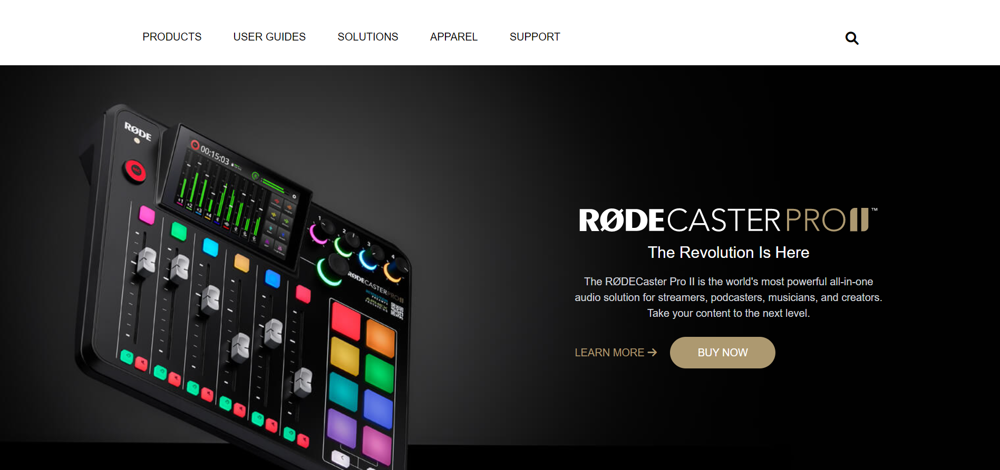

## Firstly, I'd like to thanks [Hitesh Sir](https://twitter.com/Hiteshdotcom) & the team of [iNeuron](https://ineuron.ai) for designing such a beautiful project which made me realise my potential.

## 🚀 About Me
>I'm a front-end developer...

# Hi, I'm shaQuib! 👋

## 🛠 Skills used in building this project
>HTML5 & TAILWIND CSS...
> It's my **third** project built using **Tailwind CSS**

## Name of the Project

 > Rode Landing Page Clone
 
## Time taken to complete this project
> 8 hours

## `Learning curve`
***
- Learned many important concepts of tailwind while building this project

- How to write tailwind for all the devices.

- The biggest challenge I faced while developing the page for small devices. Hence, learned tricks & tips to write effficient, neat code for the mobile devices.

 - And most importantly the confidence to convert any wireframe into a beautiful web pages.

## `Final Interface`

*** 
- Below is the screen shot of how does this web app page looks like while running on the browser.

### `SITE NAME -` [RODE Clone](https://rode-clone-ui.netlify.app/)

